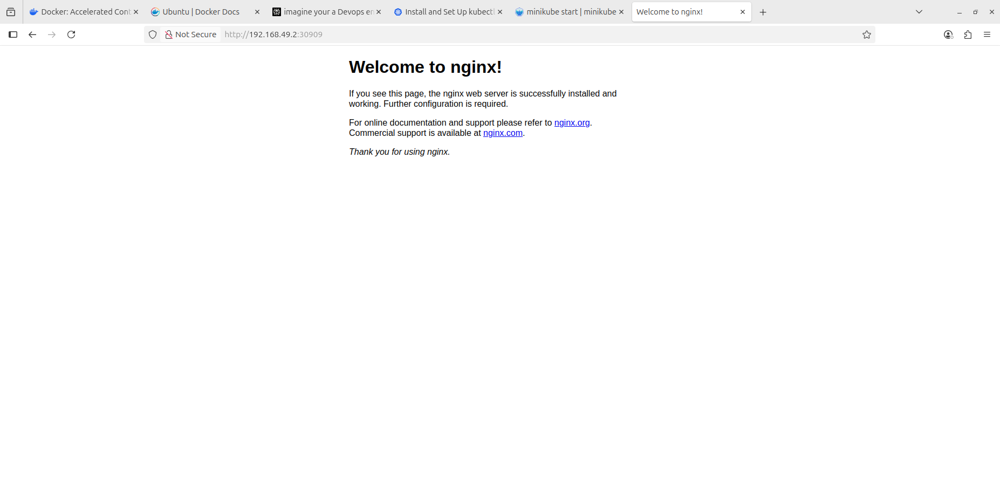

# Kubernetes Cluster with Minikube

## Objective
Deploy and manage apps in Kubernetes locally using **Minikube**, **kubectl**, and **Docker**.

## Project Structure

- `deployment.yaml`: Kubernetes Deployment manifest.
- `service.yaml`: Kubernetes Service manifest.
- `scripts/`: Automation/setup scripts.
- `docs/`: Documentation and diagrams.

## Prerequisites
- Docker
- Minikube
- kubectl

## Steps

1. **Start Minikube Cluster**  
   - `minikube start`

2. **Deploy App:**
   
   - `kubectl apply -f deployment.yaml`
   - `kubectl apply -f service.yaml`
   
4. **Check Deployment:**
   
   - `kubectl get pods`
   - `kubectl get service`
 
5. **Access Service:**
   
    `minikube service nginx-service --url`

7. **Scale Deployment:**
   
    `kubectl scale deployment/nginx-deployment --replicas=4`

9. **Update Deployment:**
      
    - Change image version in `deployment.yaml` to prefered nginx version (e.g., `nginx:1.21`).

11. **Clean Up:**
    
   - `kubectl delete -f deployment.yaml`  
   - `kubectl delete -f service.yaml`  
   - `minikube stop`

## Files

- `deployment.yaml`: Main deployment.
- `service.yaml`: Service for exposure.
- `docs/`: Architectural diagrams, screenshots.
- `scripts/`: Automation/installation scripts.

## Author
  S NAGAVEENA

## Architecture
  

